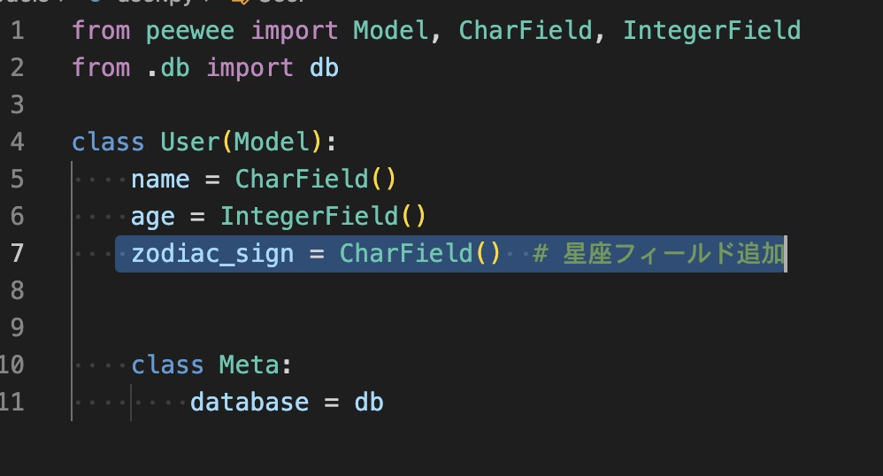
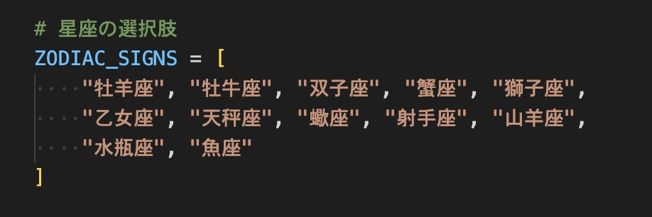
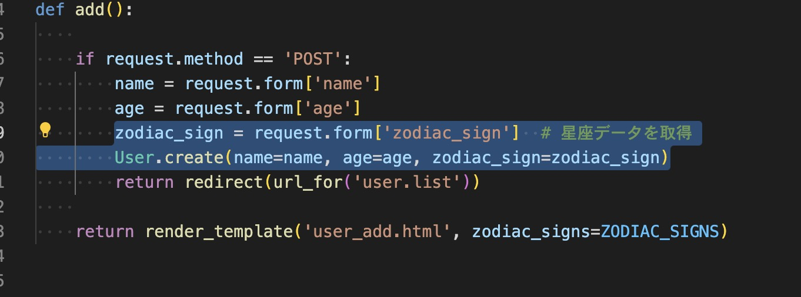
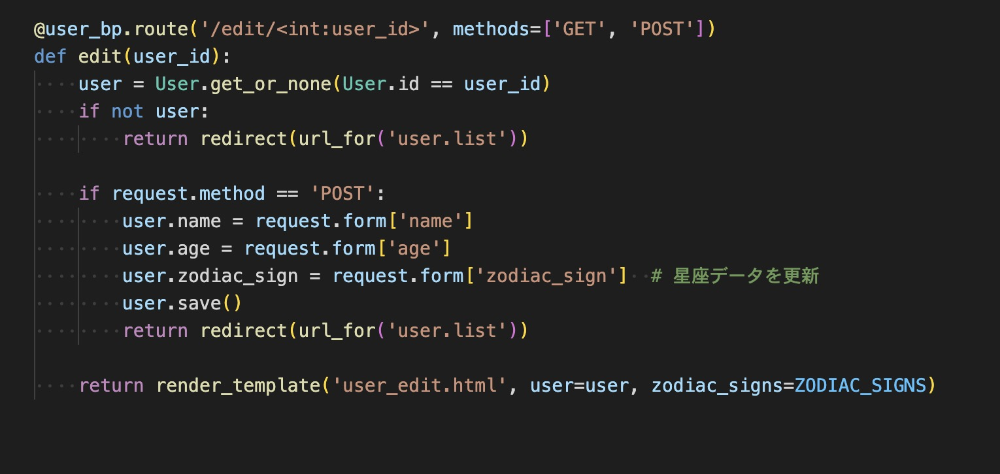
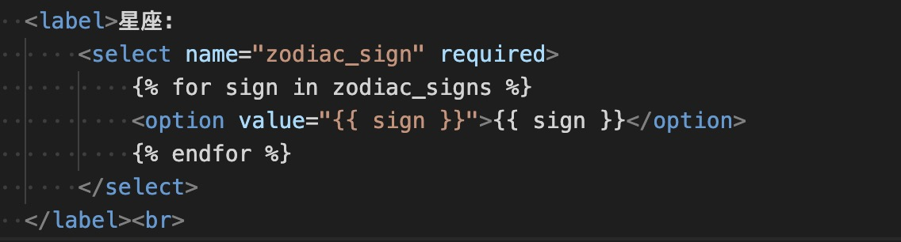
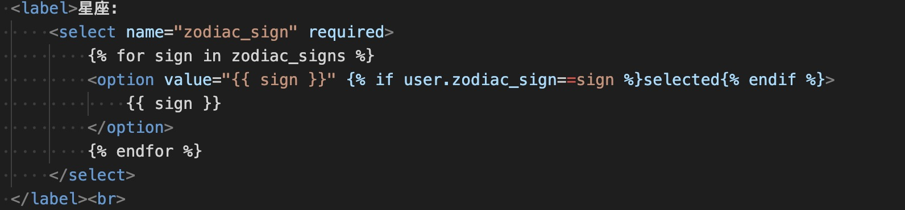
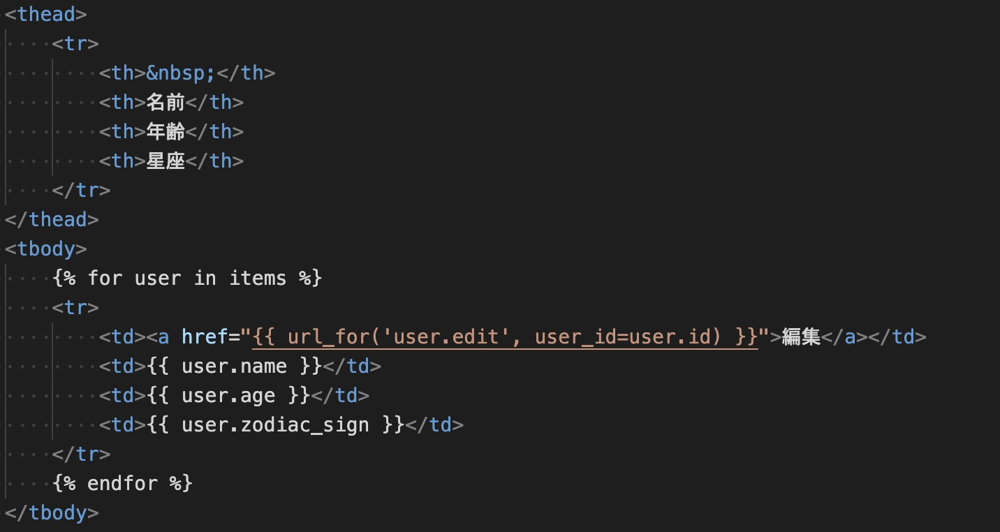

---

# データ登録アプリケーションにて登録するデータ
ユーザー一覧  
血液型  
好きな教科  

---

# 実装したコードの詳細な説明
今回実装したコードについて、データ形式やデータ型を含めて詳細に説明します。

---

## modelsの変更

`models/user.py` に以下の変更を加えました。

### 変更内容　  

### 説明
- **データ型**: `CharField`
  - Peewee のフィールド型で、文字列を格納するために使用。
  - 星座（例: "牡羊座", "魚座"）を保存するために使用します。
---
## routeの変更
## 星座のリストの定義

`routes/user.py` 内で、星座のリストを定義しました。
  
### `zodiac_sign` の追加  

### 説明
- **データベースの構造**:
  - テーブル名: `user`
  - カラム名: `zodiac_sign`
  - 格納されるデータ形式: str（文字列）
  - **データ形式**: リスト
- **用途**:
  - 星座をドロップダウン選択肢として提供するために使用。
- **リストの内容**:
  - 12星座が日本語で文字列として格納されています。

### `add` 関数

- **`request.form['zodiac_sign']`**:
  - フォームから送信された星座の値を取得します。
  - **データ型**: 文字列
- **`User.create`**:
  - `name`, `age`, `zodiac_sign` を受け取り、新しいユーザーをデータベースに保存します。
  - **データ型**:
    - `name`: 文字列
    - `age`: 整数
    - `zodiac_sign`: 文字列

### `edit` 関数

- **`request.form['zodiac_sign']`**:
  - 編集フォームから送信された星座の値を取得します。
  - **データ型**: 文字列
- **`user.zodiac_sign`**:
  - 取得した星座の値をデータベースに保存します。

---

## HTML の変更

### ユーザー追加画面 (`user_add.html`)

- **`<select>` タグ**:
  - 星座を選択するためのドロップダウンを提供します。
  - **データ形式**: ユーザーが選択した星座の値が文字列として送信されます。
- **``**:
  - 定義した `ZODIAC_SIGNS` リストをループして選択肢を生成します。

---

### ユーザー編集画面 (`user_edit.html`)

- **機能**:
  - 編集画面で現在選択されている星座を表示し、変更が可能。
- **`selected`**:
  - 現在の星座が選択された状態でドロップダウンを表示します。

---

### ユーザー一覧画面 (`user_list.html`)

- **追加した列**:
  - 星座 (`<th>星座</th>`)
  - 保存された星座が表示されます。

---

## 全体のデータフロー

1. ユーザー追加画面で名前、年齢、星座を入力し、送信。
2. データベースに `name`, `age`, `zodiac_sign` が保存される。
3. 一覧画面で全ユーザーの名前、年齢、星座が表示される。
4. 編集画面で各フィールドを編集可能。
5. 更新後、変更内容がデータベースに保存される。

---

## 利用するデータ型のまとめ

| フィールド名       | データ型    | 説明                |
|--------------------|------------|---------------------|
| `name`            | 文字列     | ユーザーの名前       |
| `age`             | 整数       | ユーザーの年齢       |
| `zodiac_sign`     | 文字列     | ユーザーの星座       |

---

